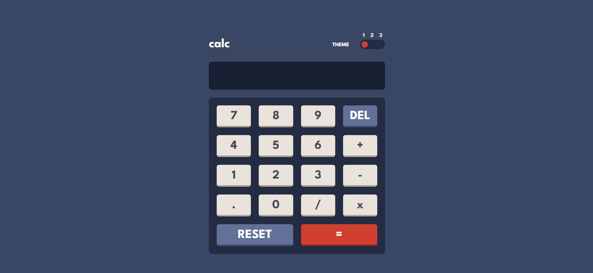
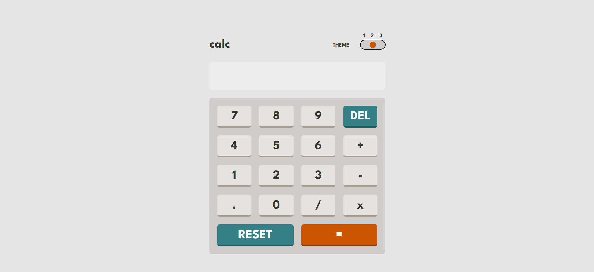
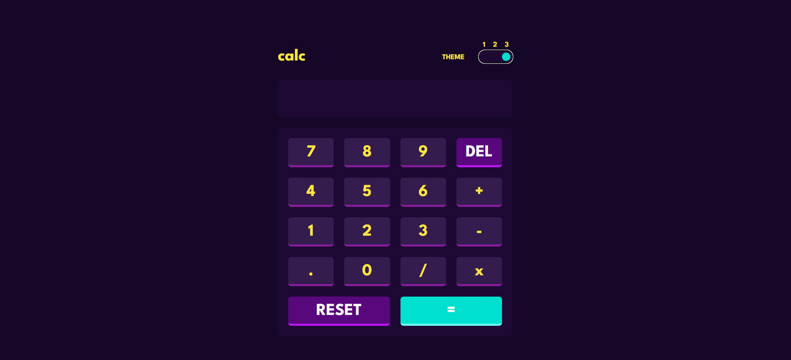

# Calculator App

This is a simple calculator app built using HTML, Tailwind CSS, and JavaScript. The app supports three different themes: dark, light, and purple.

## Screenshots

_Dark Theme_

_Light Theme_

_Purple Theme_

## Live Site

Check out the live site [here](https://calculat0r-4pp.netlify.app/).

## Features

- Basic arithmetic operations (addition, subtraction, multiplication, division)
- Reset button to clear the calculator
- Keyboard support for numeric input and operators
- Responsive design for different screen sizes
- Three different themes to choose from: dark, light, and purple

## Installation

1. Clone the repository: `git clone https://github.com/your-username/calculator.git`
2. Navigate to the project directory: `cd calculator`
3. Install the dependencies: `npm install`
4. Start the development server: `npm run dev`
5. Open your web browser and visit `http://localhost:3000` (or the specified port)

## Usage

1. Enter numbers and operators using the calculator buttons or your keyboard.
2. Click the equal (=) button or press the Enter key to evaluate the expression.
3. To switch between themes, click the theme switcher button.

## Contributing

Contributions are welcome! If you would like to contribute to this project, please follow these steps:

1. Fork the repository.
2. Create a new branch for your feature or bug fix.
3. Commit your changes.
4. Push your branch to your forked repository.
5. Submit a pull request.

## License

This project is licensed under the [MIT License](LICENSE).
